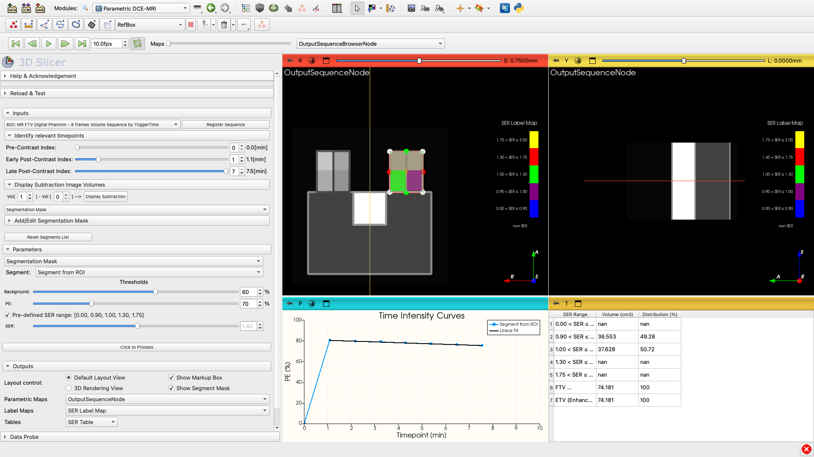

<h1 align="center">
  Semi-Quantitative DCE-MRI parameters estimation
   
</h1>
<h2 align="center">SeQ-DCEMRI Extension for <a href="https://slicer.org" target="_blank">3D Slicer</a></h2>

  <a href="#overview">Overview</a> •
  <a href="#key-features">Key Features</a> •
  <a href="#comparison-with-slicerftvdcemri">Comparison with Slicer FTV DCEMRI</a> •
  <a href="#installation-and-setup">Installation and Setup</a> •
  <a href="#user-guide">User Guide</a> •
  <a href="#example-of-use">Example of Use</a> •
  <a href="#acknowledgments">Acknowledgments</a> •
  <a href="#license-information">License</a> •
  <a href="#references">References</a>

 </a>

# Overview

[SeQ-DCEMRI] is a slicer extension created to derive semi-quantitative parametric maps from signal intensity analysis of Dynamic Contrast-Enhanced Magnetic Resonance Imaging (DCE-MRI) datasets. 

Semi-quantitative DCE-MRI refers to the analysis of DCE-MRI data using metrics that summarize the enhancement patterns of tissues over time after contrast injection. It focuses on relative signal changes, such as the rate and extent of contrast uptake and washout, rather than pharmacokinetic models derived from $T_1$ quantitative measurements. Common parameters include **Peak Enhancement** (PE), which measures the maximum signal increase respect to pre-contrast baseline signal levels, **Signal Enhancement Ratio** (SER), which compares the signal intensity at different time points to infer tissue vascularity and permeability, and **Functional Tumour Volume** (FTV), which refers to the volume of tumor tissue that shows specific patterns of contrast enhancement, typically associated with active tumor regions. The semi-quantitative approach offers a practical and less complex way to evaluate tissue behavior, particularly in oncology, without requiring detailed pharmacokinetic modeling[^1].

# Key Features
The [SeQ-DCEMRI] Slicer extension is based on the three time-point (3TP) analysis method to calculate the FTV[^2][^3]. It offers flexibility in selecting the pre-contrast, early and late post-contrast time-points, and allows for optimising FTV measurements by modifying the PE and SER thresholds[^4].

# Comparison with [Breast DCE-MRI FTV]
[SeQ-DCEMRI] is based on the [Breast DCE-MRI FTV] Slicer extension. The algorithms to calculate the SER and FTV parameters are equivalent, but we have simplified its implementation by leveraging the use of [Sequences](https://slicer.readthedocs.io/en/latest/user_guide/modules/sequences.html) to manage 4D datasets, hence, it can process any DCEMRI dataset that can be loaded as, or combined into, a sequence. Furthermore, if the [Sequence Registration](https://github.com/moselhy/SlicerSequenceRegistration#volume-sequence-registration-for-3d-slicer) module is installed, it gives the option to register the dataset prior to the analysis.

By embedding the [Segment Editor](https://slicer.readthedocs.io/en/latest/user_guide/modules/segmenteditor.html) into the [SeQ-DCEMRI] GUI, the user can define a precise region-of-interest (ROI) covering the tumour tissue and excluding non-tumour areas. 

# Installation and Setup

# User Guide

# Example of Use

# Acknowledgments
This project has been supported by ...

# License Information

This project is licensed under the terms of the [Slicer License](https://github.com/Slicer/Slicer/blob/master/License.txt)

# References
[^1]: Hylton, Nola M. and Blume, Jeffrey D. and Bernreuter, Wanda K. and Pisano, Etta D. and Rosen, Mark A. and Morris, Elizabeth A. and Weatherall, Paul T. and Lehman, Constance D. and Newstead, Gillian M. and Polin, Sandra and Marques, Helga S. and Esserman, Laura J. and Schnall, Mitchell D. (2012). Locally advanced breast cancer: MR imaging for prediction of response to neoadjuvant chemotherapy—results from ACRIN 6657/I-SPY TRIAL. [Radiology, 263(3), 663-672.](https://pubs.rsna.org/doi/10.1148/radiol.12110748)

[^2]: Degani, Hadassa and Gusis, Vadim and Weinstein, Daphna and Fields, Scott and Strano, Shalom (1997). Mapping pathophysiological features of breast tumors by MRI at high spatial resolution. [Nature Medicine, 3(7), 780-782.](https://www.nature.com/articles/nm0797-780)

[^3]: Furman-Haran, Edna and Degani, Hadassa (2002). Parametric Analysis of Breast MRI. [Journal of Computer Assisted Tomography, 26(3), 376-386.](https://journals.lww.com/jcat/abstract/2002/05000/parametric_analysis_of_breast_mri.12.aspx)

[^4]: Musall, Benjamin C. and Abdelhafez, Abeer H. and Adrada, Beatriz E. and Candelaria, Rosalind P. and Mohamed, Rania M.M. and Boge, Medine and Le-Petross, Huong and Arribas, Elsa and Lane, Deanna L. and Spak, David A. and Leung, Jessica W.T. and Hwang, Ken-Pin and Son, Jong Bum and Elshafeey, Nabil A. and Mahmoud, Hagar S. and Wei, Peng and Sun, Jia and Zhang, Shu and White, Jason B. and Ravenberg, Elizabeth E. and Litton, Jennifer K. and Damodaran, Senthil and Thompson, Alastair M. and Moulder, Stacy L. and Yang, Wei T. and Pagel, Mark D. and Rauch, Gaiane M. and Ma, Jingfei (2021). Functional Tumor Volume by Fast Dynamic Contrast-Enhanced MRI for Predicting Neoadjuvant Systemic Therapy Response in Triple-Negative Breast Cancer. [Journal of Magnetic Resonance Imaging, 54(1), 251-260.](https://onlinelibrary.wiley.com/doi/abs/10.1002/jmri.27557)

[SeQ-DCEMRI]: https://github.com/jlulloaa/SlicerSemiQuantDCEMRI

[Breast DCE-MRI FTV]: https://github.com/rnadkarni2/SlicerBreast_DCEMRI_FTV
