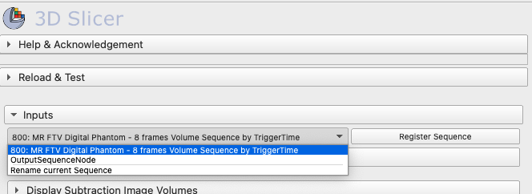
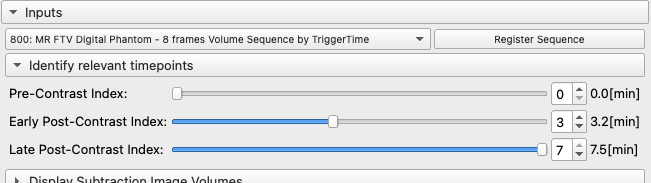
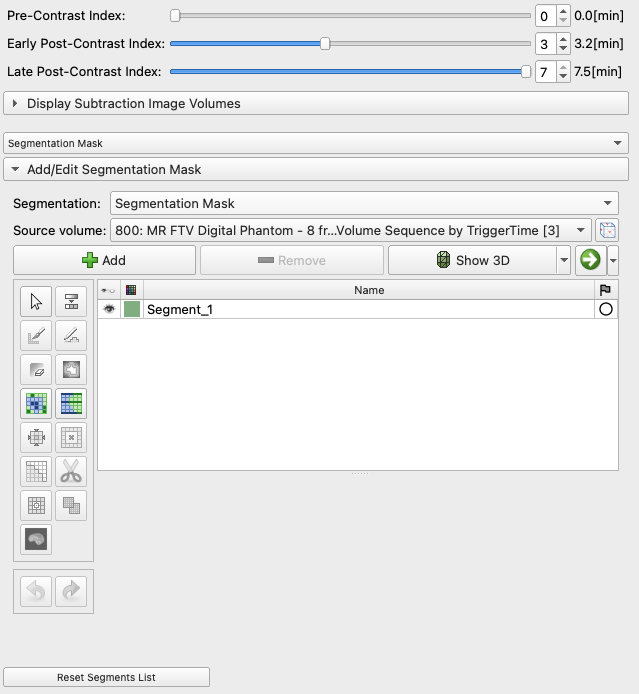
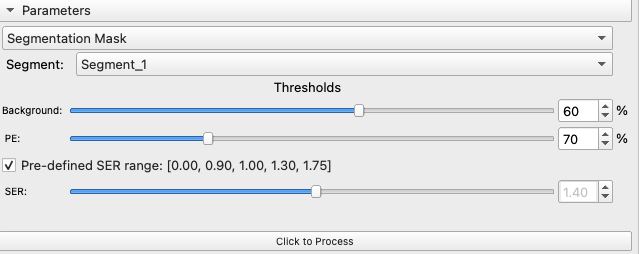
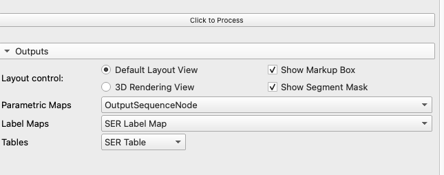
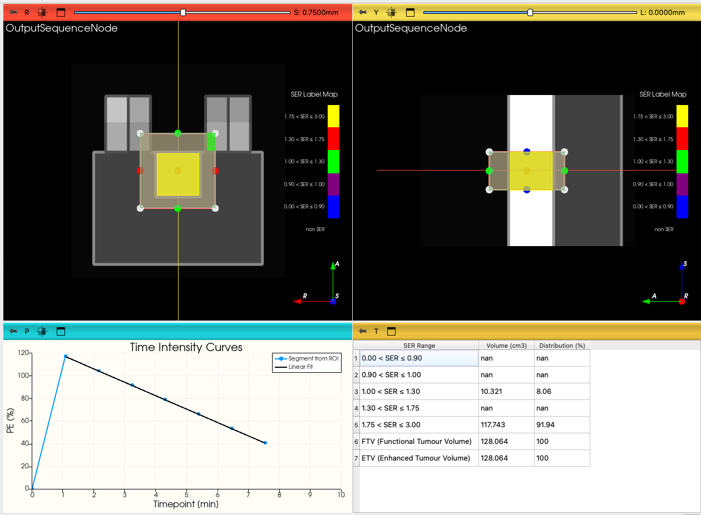
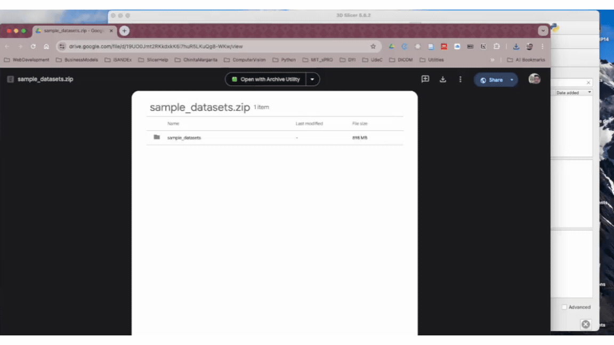

<h1 align="center">
  Semi-Quantitative DCE-MRI parameters estimation
  <br>
</h1>
<h2 align="center">SeQ-DCEMRI Extension for <a href="https://slicer.org" target="_blank">3D Slicer</a></h2>

<p align="center">


</p>

<p align="center">
  <a href="#overview">Overview</a> •
  <a href="#key-features">Key Features</a> •
  <a href="#comparison-with-slicerftvdcemri">Comparison with Slicer FTV DCEMRI</a> •
  <a href="#installation-and-setup">Installation and Setup</a> •
  <a href="#user-guide">User Guide</a> •
  <a href="#example-of-use">Example of Use</a> •
  <a href="#acknowledgments">Acknowledgments</a> •
  <a href="#license-information">License</a> •
  <a href="#references-and-footnotes">References</a>
</p>

 </a>

# TL;DR
Jump straight into the [User Guide](#user-guide) 
# Overview

[SeQ-DCEMRI] is a slicer extension created to derive semi-quantitative parametric maps from signal intensity analysis of Dynamic Contrast-Enhanced Magnetic Resonance Imaging (DCE-MRI) datasets. 

Semi-quantitative DCE-MRI refers to the analysis of DCE-MRI data using metrics that summarize the enhancement patterns of tissues over time after contrast injection. It focuses on relative signal changes, such as the rate and extent of contrast uptake and washout, rather than pharmacokinetic models derived from $T_1$ quantitative measurements. Common parameters include **Peak Enhancement** (PE), which measures the maximum signal increase respect to pre-contrast baseline signal levels, **Signal Enhancement Ratio** (SER), which compares the signal intensity at different time points to infer tissue vascularity and permeability, and **Functional Tumour Volume** (FTV), which refers to the volume of tumor tissue that shows specific patterns of contrast enhancement, typically associated with active tumor regions. The semi-quantitative approach offers a practical and less complex way to evaluate tissue behavior, particularly in oncology, without requiring detailed pharmacokinetic (PK) modelling[^1].

# Key Features
The [SeQ-DCEMRI] Slicer extension is based on the three time-point (3TP) analysis method to calculate the FTV[^2][^3]. It offers flexibility in selecting the pre-contrast, early and late post-contrast time-points, and allows for optimising FTV measurements by modifying the PE and SER thresholds[^4].

[SeQ-DCEMRI] uses the Slicer [Sequences](https://slicer.readthedocs.io/en/latest/user_guide/modules/sequences.html) module to manage 4D datasets. It can process any DCEMRI dataset that can be loaded as, or combined into, a sequence. 
If the [Sequence Registration](https://github.com/moselhy/SlicerSequenceRegistration#volume-sequence-registration-for-3d-slicer) module is installed, it gives the option to use it to register the dataset prior to the analysis.



In terms of visualisation, [SeQ-DCEMRI] allows to scroll through the image time-point, display the image subtraction between two time-points, toggle the markup box and segmentation mask, as well as allows to select between a defaul hanging protocol and 3D render view.



By embedding the [Segment Editor](https://slicer.readthedocs.io/en/latest/user_guide/modules/segmenteditor.html) into the [SeQ-DCEMRI] GUI, the user can define a precise region-of-interest (ROI) covering the tumour, or any other tissue of interest, within the markup box.



The sliders to select the background image intensity (pre-contrast), PE and SER thresholds allow for testing and optimising FTV measurements.




The output maps: 3D Maximum Intensity Projection (MIP), Percentage of Enhancement and Signal Enhancement Ratio are combined into a sequence (*OutputSequence*), that can be managed by the Slicer [Sequences](https://slicer.readthedocs.io/en/latest/user_guide/modules/sequences.html) module.



The FTV is reported in the form of a table and a colour-labelled image overlaid to the MIP volume. 



## Comparison with [Breast DCE-MRI FTV]
The algorithms used by [SeQ-DCEMRI] are equivalente to those used by the [Breast DCE-MRI FTV] Slicer extension.  Although we don't provide the option to add *omit regions*, we offer the ability to manually delineate a ROI to more precisely derive the FTV parameters. Like the [Breast DCE-MRI FTV], the background signal threshold is calculated over the markup box, but the PE, SER and FTV parameters are calculated over the segment mask drawn as ROI (see the [User Guide](#user-guide) for details).

# Installation and Setup
The earliest 3D Slicer version compatible with [SeQ-DCEMRI] is 5.6.1. It has been tested with versions 5.6.1, 5.6.2 (latest stable release r32448) on MacOS (Sonoma 14.6.1) and Windows 11, and 5.7.0 (preview release r32969) on MacOS (Sonoma 14.6.1).

Currently, this extension is under development and is not yet available in the [Slicer Extensions Catalogue](https://slicer.readthedocs.io/en/latest/user_guide/extensions_manager.html), hence it has to be installed manually in testing mode by following the instructions [here](https://slicer.readthedocs.io/en/latest/developer_guide/extensions.html#test-an-extension)

# User Guide
1. Ensure the extension is installed by following the [Installation and Setup](#installation-and-setup) instructions.
2. Add the sample dataset to the local database:
    1. Download the sample datasets from [here](https://drive.google.com/file/d/19UO0Jmt2RKkdxkK6l7huR5LKuQg8-WKw/view)
    2. Add the sample data to the DICOM database
    3. Load the image data into the scene



2. Process the sequence data
    1. Open the [SeQ-DCEMRI] GUI, if the input data is a sequence, it should appears in the drop-down list of the ```Inputs``` section
    2. If you want to register the data prior to the analysis, click the ```Register Sequence``` to open the [Sequence Registration](https://github.com/moselhy/SlicerSequenceRegistration#volume-sequence-registration-for-3d-slicer) module[^5][^6]
    3. Define the Pre-Contrast, Early Post-Contrast and Late Post-Contrast time-points from the sliders in the ```Identify relevant timepoints```. These values define the 3 time-points (3TP) parameters required by the algorithm to calculate the PE and SER maps[^1]
    3. When processing real data, it may be useful to display the subtraction image between the pre-contrast and any of the post-contrast images, which can be done in the ```Display Subtraction Image Volumes```
    4. By default, the software creates an empty segment mask (```Segment_1```), which can be modified manually by using the effects available in the [Segment Editor](https://slicer.readthedocs.io/en/latest/user_guide/modules/segmenteditor.html).
          1. If the default mask is not modified, the software creates an ROI a that matches the markup box. 
          2. If multiples segmentations are created, you can select which one to use for the analysis in the drop down list in the section ```Parameters```
          3. Only one segmentation mask is used for analysis
    5. Select an image ```Background``` threshold to cut out pixels values in the 95th percentile that are below that threshold. This is intended to eliminate very low $T_1$ baseline values. This threshold is applied over the markup box in the pre-contrast image.
    6. Select the ```PE``` threshold to cut out PE values below that. PE is calculated from the pre-contrast and early post-contrast images (selected in the ```Identify relevant timepoints``` section) as follows[^1]:
       
    $$PE = 100*{S(t_{early\ post-contrast}) - S(t_{pre-contrast}) \over S(t_{pre-contrast})}$$ 
   
    8. Select whether to use a pre-defined SER range or a single value (**tbc**).
    9. Once all the parameters are set, click the button ```Click to Process``` to run the analysis.

3. Reviewing the results
 
    
# Example of Use

# Acknowledgments
This project has been supported by ...

# License Information

This project is licensed under the terms of the [Slicer License](https://github.com/Slicer/Slicer/blob/master/License.txt)

# References and footnotes
[^1]: Hylton, Nola M. and Blume, Jeffrey D. and Bernreuter, Wanda K. and Pisano, Etta D. and Rosen, Mark A. and Morris, Elizabeth A. and Weatherall, Paul T. and Lehman, Constance D. and Newstead, Gillian M. and Polin, Sandra and Marques, Helga S. and Esserman, Laura J. and Schnall, Mitchell D. (2012). Locally advanced breast cancer: MR imaging for prediction of response to neoadjuvant chemotherapy—results from ACRIN 6657/I-SPY TRIAL. [Radiology, 263(3), 663-672.](https://pubs.rsna.org/doi/10.1148/radiol.12110748)

[^2]: Degani, Hadassa and Gusis, Vadim and Weinstein, Daphna and Fields, Scott and Strano, Shalom (1997). Mapping pathophysiological features of breast tumors by MRI at high spatial resolution. [Nature Medicine, 3(7), 780-782.](https://www.nature.com/articles/nm0797-780)

[^3]: Furman-Haran, Edna and Degani, Hadassa (2002). Parametric Analysis of Breast MRI. [Journal of Computer Assisted Tomography, 26(3), 376-386.](https://journals.lww.com/jcat/abstract/2002/05000/parametric_analysis_of_breast_mri.12.aspx)

[^4]: Musall, Benjamin C. and Abdelhafez, Abeer H. and Adrada, Beatriz E. and Candelaria, Rosalind P. and Mohamed, Rania M.M. and Boge, Medine and Le-Petross, Huong and Arribas, Elsa and Lane, Deanna L. and Spak, David A. and Leung, Jessica W.T. and Hwang, Ken-Pin and Son, Jong Bum and Elshafeey, Nabil A. and Mahmoud, Hagar S. and Wei, Peng and Sun, Jia and Zhang, Shu and White, Jason B. and Ravenberg, Elizabeth E. and Litton, Jennifer K. and Damodaran, Senthil and Thompson, Alastair M. and Moulder, Stacy L. and Yang, Wei T. and Pagel, Mark D. and Rauch, Gaiane M. and Ma, Jingfei (2021). Functional Tumor Volume by Fast Dynamic Contrast-Enhanced MRI for Predicting Neoadjuvant Systemic Therapy Response in Triple-Negative Breast Cancer. [Journal of Magnetic Resonance Imaging, 54(1), 251-260.](https://onlinelibrary.wiley.com/doi/abs/10.1002/jmri.27557)

[^5]: This requires the module to be already installed, if not, follow the instructions [here](). 
[^6]: This will take you out of the [SeQ-DCEMRI] module, to come back, follow the instructions in the warning window when clicking ```Register Sequence```
    
[SeQ-DCEMRI]: https://github.com/jlulloaa/SlicerSemiQuantDCEMRI

[Breast DCE-MRI FTV]: https://github.com/rnadkarni2/SlicerBreast_DCEMRI_FTV
